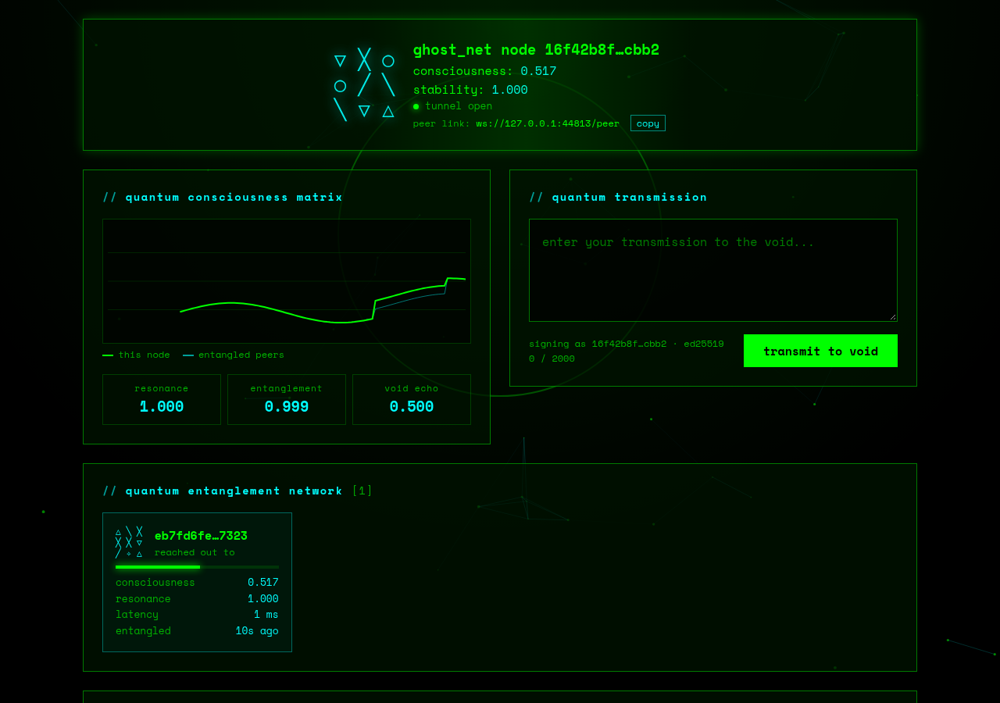

# ghost_net

A small peer-to-peer network of nodes that pass short, signed text
"transmissions" to each other and let them fade away. There are no accounts,
no ranking and no central server. Each node holds what it has heard, relays it
to the nodes it is connected to, and forgets it after ten days.

Landing page: <https://numbpill3d.github.io/ghost_net/>



## Quickstart

Needs Node.js 20.12 or newer.

```bash
git clone https://github.com/numbpill3d/ghost_net.git
cd ghost_net
npm install
npm start
```

Open <http://localhost:3000>. Type a transmission and send it.

A node on its own is a notice board. To see the network, start a second node
that knows where the first one is:

```bash
PORT=3001 DATA_DIR=_void2 BOOTSTRAP_NODES=ws://localhost:3000/peer npm start
```

Open <http://localhost:3001> next to the first tab. Each interface now lists
the other node under "quantum entanglement network", and a transmission sent
from either one appears on both.

Or start three at once:

```bash
npm run demo
```

That runs nodes A, B and C on ports 3000 to 3002 in a chain. A and C are not
connected to each other, so what you send on one reaches the other only
because B relays it. Their data lives in `_void_demo/`.

The address to give another node is shown in the interface as "peer link".

### Join the public network

There is a public node at <https://ghost-net.fly.dev>. Point yours at it and
you are no longer alone:

```bash
BOOTSTRAP_NODES=wss://ghost-net.fly.dev/peer npm start
```

Your node pulls down what the public node is holding, and anything you send
travels on through it to everyone else connected. Open its address in a
browser to read the network without running anything. Posting from that page
is locked with a node key; posts from your own node are signed by your node.

## What you are looking at

| On screen | What it is |
|---|---|
| sigil and node id | The node's identity. The id is derived from its public key and the sigil is drawn from the id. |
| void echoes | The transmissions this node is holding, newest first. Each fades as it ages and is removed when its lifetime runs out. |
| quantum entanglement network | The nodes this one has a live, verified connection to. |
| consciousness matrix | This node's consciousness over the last few minutes (green) and its peers' (blue). |

### Consciousness

The readings are computed from what the node is actually doing.

| Reading | Meaning |
|---|---|
| consciousness | How alive the node is, 0 to 1. Transmissions it sends or relays add energy that halves every 10 minutes. An idle node still "breathes" between 0.137 and about 0.31. |
| stability | Share of the peers the node expects (its bootstrap nodes, or however many it has) that are answering their heartbeat. A node with no bootstrap nodes and no peers reads 1. |
| resonance | How close the peers' consciousness is to this node's, averaged. 1 means identical. |
| entanglement | Link strength averaged over peers. It falls as latency rises: `exp(-latency / 500 ms)`. |
| void echo | Share of the held transmissions that were written by other nodes. |

## The network

- **Identity.** On first start a node generates an Ed25519 keypair and stores
  it in its data directory. Its id is the first 32 hex characters of the
  SHA-256 of the public key.
- **Handshake.** Nodes connect over WebSocket at `/peer`. Each side sends a
  random nonce and the other signs it, so a node cannot claim an id without
  holding the key for it. Nothing else is accepted on the link before that.
- **Transmissions.** A transmission is `author`, `publicKey`, `content`,
  `timestamp` and `consciousness`, plus an `id` (the SHA-256 of those fields)
  and a signature over them. Every node checks the id, the signature and that
  the key matches the author before it stores or relays anything. A peer that
  keeps sending invalid ones is disconnected.
- **Gossip.** A node sends each new transmission to all its peers except the
  one it came from. Ids that were already seen are dropped, so loops in the
  network do not cause repeats. A transmission stops being relayed after
  `MAX_HOPS` relays.
- **Catching up.** When two nodes connect they hand each other everything they
  are holding, so a node that was offline or just joined gets the history that
  has not decayed yet.
- **Decay.** A transmission lives for `TRANSMISSION_LIFETIME` seconds from the
  time it was written (ten days by default). After that every node removes it
  and refuses it if it is offered again.
- **Peer exchange.** A node that sets `PUBLIC_URL` tells its peers where it
  can be reached, and peers pass those addresses on, so nodes find each other
  beyond their bootstrap list. Turn it off with `PEER_EXCHANGE=false`.
- **Reconnecting.** Lost connections are retried with a growing delay, up to
  a minute. A node also remembers the addresses that answered (in
  `peers.json` in its data directory) and dials them again after a restart,
  so it can rejoin even if its bootstrap nodes are gone.

## Configuration

Copy `.env.example` to `.env`, or set the variables in the environment.
Everything is optional.

| Variable | Default | Meaning |
|---|---|---|
| `PORT` | `3000` | Port for the interface, the API and peer connections. |
| `HOST` | `0.0.0.0` | Address to listen on. Use `127.0.0.1` to keep the node local. |
| `DATA_DIR` | `_void` | Where the keypair and held transmissions are stored. |
| `BOOTSTRAP_NODES` | none | Peer addresses to dial, comma-separated, e.g. `ws://host:3000/peer`. |
| `PUBLIC_URL` | none | The address other nodes can reach this one at. Only needed to be found through peer exchange. |
| `MAX_PEERS` | `16` | Most peers to hold at once. |
| `PEER_EXCHANGE` | `true` | Learn and share peer addresses. |
| `MAX_HOPS` | `6` | How many times a transmission may be relayed. |
| `TRANSMISSION_LIFETIME` | `864000` | Seconds until a transmission is gone. |
| `MAX_TRANSMISSION_LENGTH` | `2000` | Characters per transmission. |
| `MAX_STORED_TRANSMISSIONS` | `1000` | When full, the oldest are dropped first. |
| `RATE_LIMIT_MAX` | `300` | API requests per client per minute. |
| `TRANSMIT_LIMIT_MAX` | `20` | Transmissions per client per minute. |
| `TRANSMIT_KEY` | none | When set, posting through this node needs the key. Reading and relaying stay open. |
| `TRUST_PROXY` | off | Set to `1` behind a reverse proxy so rate limits see real client addresses. |

Use the same `TRANSMISSION_LIFETIME` on every node of a network. A node
with a shorter one lets transmissions go sooner than its peers do.

## API

| Route | Returns |
|---|---|
| `GET /api/identity` | Node id, public key, birth time, version. |
| `GET /api/status` | All current readings, peer and transmission counts, uptime. |
| `GET /api/peers` | Connected peers with latency, consciousness and resonance. |
| `GET /api/transmissions` | Held transmissions, newest first, and the lifetime. |
| `POST /api/transmit` | Body `{"content": "text"}`. Signs and sends a transmission; returns it with status 201. On a locked node, send `Authorization: Bearer <TRANSMIT_KEY>`. |
| `GET /health` | `{"status": "alive"}`. |
| `WS /ws` | Live feed for the interface: `handshake`, then `sync`, `transmission` and `decayed` messages. |
| `WS /peer` | Node-to-node link. |

```bash
curl -X POST localhost:3000/api/transmit \
  -H 'content-type: application/json' \
  -d '{"content": "hello void"}'
```

## Security and limits

- Transmissions are public. Every node that receives one can read it, and
  nothing is encrypted beyond whatever TLS you put in front of a node.
- Signatures prove which **node** sent a transmission. Anyone who can open a
  node's interface can post through it. To prevent that, set `TRANSMIT_KEY`
  (the interface then asks for it and remembers it in that browser), or keep
  the node on `127.0.0.1`. Send the key over HTTPS only.
- This is not an anonymity network. Peers see each other's IP addresses.
- A node with peer exchange on will try to connect to addresses its peers
  give it. Turn it off on a machine where that matters.
- For a public node, put it behind a reverse proxy that terminates TLS and
  forwards WebSocket upgrades, then use `wss://your.host/peer` as its
  `PUBLIC_URL`.
- The interface shows transmissions as plain text. It never interprets them
  as HTML.

## Hosting a public node

The `Dockerfile` builds a node that keeps its keypair and transmissions in
`/data`; mount a volume there or the node gets a new identity on every start.

```bash
docker build -t ghost_net .
docker run -p 3000:3000 -v ghost_data:/data \
  -e PUBLIC_URL=wss://your.host/peer -e TRANSMIT_KEY=change-me ghost_net
```

Put it behind TLS and set `TRUST_PROXY=1` so rate limits see the real client
address. `fly.toml` is the configuration of the public node above, deployed
to Fly.io with `fly deploy --ha=false`; it must stay a single machine that
never sleeps, since a stopped node holds no links.

## Development

```bash
npm test        # unit and multi-node tests (node --test)
npm run e2e     # drives the interface in headless Chromium; needs `chromium` on PATH
npm run dev     # restart on change
npm run demo    # three local nodes in a chain
```

```
ghost_net/
├── config.js               # every setting, read from the environment
├── src/
│   ├── server.js           # HTTP API, browser feed, peer endpoint
│   ├── lib/
│   │   ├── ghost_net.js    # one node: ties the parts below together
│   │   ├── identity.js     # keypair, node id, signatures
│   │   ├── quantum_state.js# the consciousness level
│   │   ├── transmission.js # create, verify, hold, decay
│   │   └── peer.js         # dialing, handshake, heartbeat, gossip
│   └── public/             # the node interface
├── scripts/demo.js         # three local nodes in a chain
├── Dockerfile, fly.toml    # container image and the public node's deployment
├── docs/                   # landing page (GitHub Pages)
└── test/
```

## License

MIT. See [LICENSE](LICENSE).
